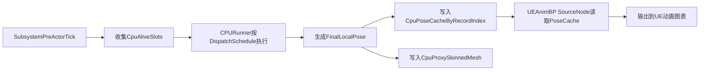
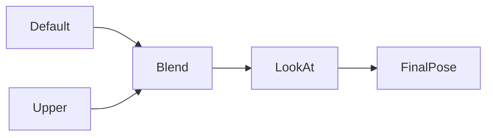
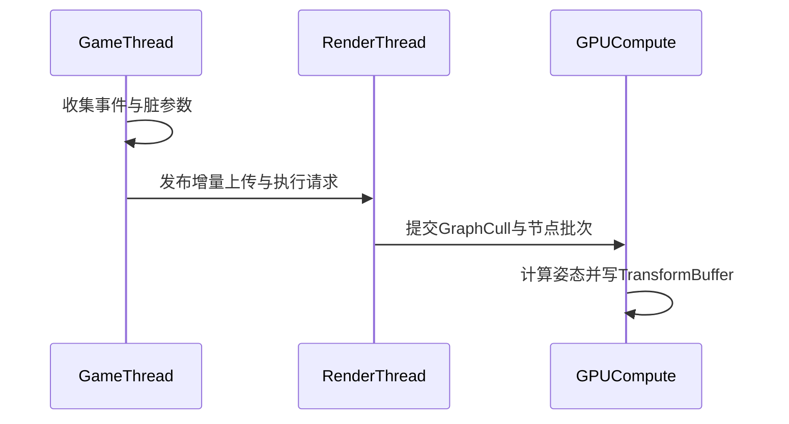

# 实例动画图（GameInstancedAnimationGraph[GIAG]）

[中文](README_CN.md)|[English](../README.md)|[节点编写规则](NewNodeRule_CN.md)

从一个问题出发：如果游戏中存在巨量动画实体，如何让动画系统既保留可编程能力，又具备可落地的规模化性能。


本文定位为框架设计说明，重点解释系统分层、数据流和性能策略。

## 框架思路

GIAG 的目标是解决大规模实体下动画模拟开销过高的问题，提供 CPU 与 GPU 两条同构高性能路径，并由业务按 LOD 策略分配实例。

核心原则：

- CPU 近景高表现路径：距离玩家近、交互密集或需要更高表现质量的实例切到 CPU。
- GPU 大规模 LOD 路径：中远景与海量实体走 GPU Compute，以吞吐优先。
- 事件驱动上传：不是每帧全量同步，而是仅在状态变化时上传脏数据。
- 编译期前置：拓扑解析、调度分批、姿态空间收敛尽量在编译期完成。
- 业务侧配额控制：例如同屏最多保留 16 个 CPU 实例，其余实例走 GPU（本框架没支持，业务逻辑要自行决定策略）。

设计取舍：

- 优先保证近景表现与远景吞吐的整体平衡，而非只优化单一后端。
- 接受一定的系统复杂度，以换取万级以上实例时的稳定帧预算。
- 通过同构 CPU/GPU 语义降低双后端维护风险。
- 因为双端逻辑同构，切换时姿态与行为跳变可控，视觉突变明显小于异构方案。


### 性能关键约束与策略

- 事件驱动外推：CPU 只在状态变化时提交事件，GPU 每帧根据当前时间外推播放进度，不做每帧全量同步。  
  外推公式（示意）：

  $$
  t_{\text{raw}}=(t_{\text{now}}-t_{\text{event}})\cdot Rate+t_{\text{start}}
  $$

  用“事件发生到现在的时间差”推算理论播放时间

- 节点合批：编译后按节点类型分批执行（`DispatchSchedule`），同类型节点共享一次调度路径。  
  - 减少 dispatch 次数与驱动开销。
  - 降低状态切换成本，提高 GPU/CPU 侧数据局部性。
  - 为大实例数场景提供更稳定的吞吐表现。

- 脏数据稀疏上传：参数与变换按 slot 级脏标记上传，避免“全实例、全节点、每帧重传”。

- 活跃实例过滤：通过 `ActiveInstanceIndices` 配合可见性/业务 LOD，只计算当前需要更新的实例集合。

## 编译流程

GIAG 通过编译阶段将“可编程动画图”转换为“可高效执行的数据与调度结构”。

主要阶段：

1. 构图：`BuildGraph` 声明节点、连线和最终输出。
2. 节点编译：收集节点元数据、实例偏移、参数布局、输入输出 pin 信息。
3. 资源规划：分配 pose resource，并生成姿态空间转换任务（`PoseConvertTasks`）。
4. 调度生成：构建 `ExecOrder`、`DispatchSchedule`、`ReverseDispatchSchedule`。
5. 裁剪编译：生成 node cull 相关表与图级 cull 资源绑定信息。

编译产物直接服务运行时：

- 运行时无需再做拓扑排序。
- 批次按节点类型聚合，降低调度开销。
- 姿态空间在调度链路中显式收敛，减少隐式转换成本。

## GPU后端

GPU 后端采用 GT/RT 分工模型：

- GT（GameThread）：收集脏数据、构建增量上传包、发布任务与资源请求。
- RT（RenderThread）：消费上传包，构建 RDG Pass，驱动 Compute 执行并写入 TransformBuffer。

资源准备流程：

- 骨骼静态资源：`ParentIndices`、`InverseRefPose`、`RefPose`。
- 动画库资源：Clip 元数据与 TRS 数据，支持增量更新与容量扩展。
- 节点参数资源：按节点参数布局进行稀疏上传。
- 活跃实例映射：`ActiveInstanceIndices`，用于只计算可见/活跃槽位。

配置准备流程：

- 绑定编译产物（调度表、pose resource、cull 参数符号）。
- 绑定运行参数（实例数、骨骼数、时间、输出偏移）。
- 在有 cull 能力时先执行 GraphCull，生成 `NeedNodeBits`，再驱动节点批次调度。

GPU 调度主链路（框架视角）：


## CPU后端

CPU 调度主链路（含输出到 UE 动画图）：



主路径说明：

- 帧前阶段在 GT 预计算 CPU 姿态，避免 AnimBP 在多线程阶段重复解算。
- `CpuPoseCache` 作为桥接层，供 UE 动画图 Source Node 直接读取。
- 对纯 CPU 代理实例，同步输出到 `CpuProxyActor/SkinnedMeshComponent`，保证可见结果一致。

CPU 后端的典型使用场景：

- 近景高表现：玩家附近关键角色、交互密集角色优先走 CPU。
- LOD 混合：同一世界中部分实例走 CPU，部分实例走 GPU。

### ISPC加速

ISPC（Intel SPMD Program Compiler）可以理解为“用接近标量代码的写法，编译出 CPU SIMD 向量指令”的工具。  
它解决的是 CPU 端算子性能问题，不改变动画图的拓扑和调度语义。
纯计算层面能获得4倍/8倍的性能提升（看对应平台指令集支持情况）。

为什么它适合 GIAG：

- 动画计算里存在大量“同一逻辑、批量数据”的循环（按实例/按骨骼遍历），天然适合 SIMD。
- 姿态空间转换、TRS 运算、批量混合这类热点以纯数学为主，分支少、数据结构稳定。
- 在 AVX2/AVX-512 等指令集可用时，通常能明显降低单帧 CPU 计算时间（具体收益取决于平台与数据形态）。

### 接入UE动画系统


- 与 UE 渲染管线保持一致的数据入口。
- 让 GIAG 作为“动画计算后端”接入，而不是破坏 UE 原有渲染组织。

## 业务 API 最小使用方式

业务侧通常只需要把 SkeletalMesh、GIAG 图资产和初始 Transform 交给 `UGameInstancedAnimationGraphSubsystem`，拿到 `FGameInstancedAnimationGraphHandle` 后再驱动播放、LOD 后端切换和生命周期管理。

最小创建流程（C++）：

```cpp
#include "GameInstancedAnimationGraphSubsystem.h"
#include "GIAG_AnimGraph.h"
#include "GIAG_LookAtNode.h"
#include "Engine/World.h"

FGameInstancedAnimationGraphHandle SpawnGIAGInstance(
    const UObject* WorldContextObject,
    USkeletalMesh* Mesh,
    UGIAG_AnimGraph* Graph,
    UAnimSequence* Idle,
    TSubclassOf<AActor> CpuProxyClass,
    const FTransform& InitialTransform)
{
    UWorld* World = WorldContextObject ? WorldContextObject->GetWorld() : nullptr;
    UGameInstancedAnimationGraphSubsystem* Subsystem =
        World ? World->GetSubsystem<UGameInstancedAnimationGraphSubsystem>() : nullptr;
    if (!Subsystem || !Mesh || !Graph)
    {
        return {};
    }

    // bCpuMode=false 表示初始走 GPU；业务 LOD 可以后续切到 CPU。
    FGameInstancedAnimationGraphHandle Handle =
        Subsystem->AddInstance(Mesh, Graph, InitialTransform, CpuProxyClass, false);
    if (!Handle)
    {
        return {};
    }

    Subsystem->PlayAnimation(Handle, Idle, TEXT("Default"), 0.0f, 0.0f, true, 1.0f);
    return Handle;
}
```

运行时常用操作：

```cpp
// 业务 LOD：近景或关键交互切 CPU，远景切回 GPU。
Subsystem->SetInstanceUseCPUMode(Handle, bShouldUseCPU);

// 更新实例世界变换。
Subsystem->SetInstanceTransform(Handle, NewTransform);

// 修改节点运行时参数，例如 LookAt 目标。
auto LookAtNode = Subsystem->FindAnimNode<FGIAG_LookAtNode>(Handle, TEXT("LookAt"));
if (LookAtNode)
{
    LookAtNode->SetTargetLocationWS(LookAtNode, TargetLocationWS);
}

// 实例不再需要时释放，Handle 会被置为无效。
Subsystem->RemoveInstance(Handle);
```

常用扩展 API：

- Leader/Follow：`AddFollowInstance(MasterHandle, FollowMesh)` 创建复用主实例动画与变换的跟随实例，适合装备、挂件骨骼网格等。
- Attach：`AttachStaticMesh(...)` / `AttachNiagara(...)` 将静态网格或 Niagara 绑定到指定骨骼输出。
- 材质自定义数据：`SetMaterialDataFloat(...)`、`SetMaterialDataVector2(...)`、`SetMaterialDataVector3(...)`、`SetMaterialDataColor(...)` 按实例写入材质参数，常用于颜色、阵营、受击高亮等表现。
- 后端查询：`IsInstanceUsingCPUMode(Handle)` 可用于调试或业务状态同步。

## 额外系统支持

因为存在GPU路径，不希望做GPU到CPU的回读。  
以下功能也要额外实现：

### Leader/Follow Mesh

Leader/Follow 机制用于降低重复计算：

- Leader 负责动画评估与输出。
- Follow 复用 Leader 结果，可按需要做骨骼映射。
- 该机制主要是为了优化类似`装备`这种需求，需要和主动画保持一致的情况。

### Mesh/Niagara Attach

Attach 系统用于把动画骨骼输出扩展到特效与挂件：

- Mesh Attach：将静态网格附着到骨骼输出。
- Niagara Attach：将粒子系统附着到骨骼输出。

## 图表编写方式

### 最简节点用例：ClipNode/Blend/LookAt

最简图表实现代码（示意）：

```cpp
// 1) GraphInstance：节点实例放在同一个结构体里（与项目示例一致）
USTRUCT()
struct FMyGraphInstance : public FGIAG_AnimGraphInstance
{
    GENERATED_BODY()

    FGIAG_ClipPlayerNode Default;
    FGIAG_ClipPlayerNode Upper;
    FGIAG_LayerBlendNode LayerBlend;
    FGIAG_LookAtNode LookAt;
};

// 2) AnimGraph：持有 DefaultGraphInstance，并在 BuildGraph 里按实例成员构图
UCLASS()
class UMyGIAGGraph : public UGIAG_AnimGraph
{
    GENERATED_BODY()
public:
    FMyGraphInstance DefaultGraphInstance;

    FGIAG_BlendLayerSettings BlendSettings;
    FGIAG_LookAtSettings LookAtSettings{ TEXT("head") };

    virtual FGIAG_AnimGraphInstanceRef GetDefaultGraphInstance() const override
    {
        return { DefaultGraphInstance };
    }

    virtual void BuildGraph(FGIAG_AnimGraphBuilder& Builder) const override
    {
        const auto& Instance = DefaultGraphInstance;

        const auto Default = Builder.AddNode(Instance.Default);
        const auto Upper = Builder.AddNode(Instance.Upper);
        const auto Blend = Builder.AddNode(Instance.LayerBlend, BlendSettings);
        const auto LookAt = Builder.AddNode(Instance.LookAt, LookAtSettings);

        Builder.Link(GIAG_PIN_OUT(Default, Out), GIAG_PIN_IN(Blend, Base));
        Builder.Link(GIAG_PIN_OUT(Upper, Out), GIAG_PIN_IN(Blend, Layer));
        Builder.Link(GIAG_PIN_OUT(Blend, Out), GIAG_PIN_IN(LookAt, Base));

        Builder.SetFinalPose(GIAG_PIN_OUT(LookAt, Out));
    }
};

// 3) 运行时修改动态节点参数
void SetRuntimeParams(const UObject* WorldContextObject, const FGameInstancedAnimationGraphHandle& Handle)
{
    UGameInstancedAnimationGraphSubsystem* Subsystem = World->GetSubsystem<UGameInstancedAnimationGraphSubsystem>();
    auto LookAtNode = Subsystem->FindAnimNode<FGIAG_LookAtNode>(Handle, TEXT("LookAt"));
    LookAtNode->SetTargetLocationWS(LookAtNode, TargetLocationWS);
}
```



## 节点编写方式

GIAG 节点编写遵循“同一契约，双端执行”的原则。

新增节点的完整规则、CPU/GPU 最小模板和实现约束请看：[节点编写规则](NewNodeRule_CN.md)。

节点契约：

- 明确输入/输出 pin 语义。
- 声明可选资源请求（按需，不强制）。
- 提供 GPU 与 CPU 对应执行入口。
- 可选提供 cull 逻辑（CPU/GPU 双端一致）。

最简节点实现代码示例（示意代码，省略完整参数与注册细节）：

```cpp
// C++: 最简 BlendNode 形态（示意）
USTRUCT(BlueprintType)
struct FGIAG_MinBlendNode : public FGIAG_AnimNodeBase
{
    GENERATED_BODY()

    enum class EInputPin : uint8 { A = 0, B, Num };
    enum class EOutputPin : uint8 { Out = 0, Num };

    float Alpha = 0.5f;

    const void* GatherUploadsGPU(uint32& OutStride) const
    {
        OutStride = sizeof(float);
        return &Alpha;
    }

    static void AddPassesGPU(const FGIAG_AnimNodeDispatchContext& Ctx)
    {
        // 绑定 A/B 输入姿态 + Alpha 参数，分发 BlendCS
    }

    static void AddPassesCPU(const FGIAG_AnimNodeCpuDispatchContext& Ctx)
    {
        // 调用 ISPC Kernel，对 active slots 做逐骨 Blend
    }
};
```

```hlsl
// HLSL: 最简 Blend Kernel（示意）
StructuredBuffer<float4> InPoseA;
StructuredBuffer<float4> InPoseB;
StructuredBuffer<float>  NodeAlpha;
RWStructuredBuffer<float4> OutPose;

[numthreads(64, 1, 1)]
void Main(uint DispatchId : SV_DispatchThreadID)
{
    float a = saturate(NodeAlpha[0]);
    float4 pa = InPoseA[DispatchId];
    float4 pb = InPoseB[DispatchId];
    OutPose[DispatchId] = lerp(pa, pb, a);
}
```

```ispc
// ISPC: CPU 侧最简 Blend Kernel（示意）
export void GIAG_BlendPose(
    uniform int count,
    uniform float alpha,
    uniform const float4* poseA,
    uniform const float4* poseB,
    uniform float4* outPose)
{
    foreach (i = 0 ... count)
    {
        outPose[i] = poseA[i] * (1.0f - alpha) + poseB[i] * alpha;
    }
}
```

### CPU/GPU数学运算同构策略

GIAG 的做法是：先把算法抽象成与平台无关的数学核心，再让 HLSL/ISPC 只做类型映射。

推荐写法：

1. 先定义跨端一致的数据布局（POD + 明确 padding），例如 `FGIAG_BoneTRS`。  
2. 在共享层只写纯数学算法，不依赖 UE 对象、线程状态、平台特有 API。

最小模板（以 `GIAG_MathShared.ush` 风格）：

```cpp
// Shared/GIAG_MathShared.ush（平台无关核心）
struct FGIAG_BoneTRS
{
    FQuat Rotation;
    float3 Translation;
    float TranslationPad;
    float3 Scale3D;
    float ScalePad;
};

GIAG_INLINE FQuat GIAG_NormalizeQuat(FQuat Q)
{
    const float Len2 = dot(Q, Q);
    return Q * rsqrt(Len2);
}

GIAG_INLINE FQuat GIAG_AlignQuatToRef(FQuat Ref, FQuat Q)
{
    return (dot(Ref, Q) < 0.0) ? Q * (-1.0) : Q;
}
```

跨CPU/GPU平台的魔法（宏魔法）

```hlsl
// HLSL wrapper：只做映射，不重写算法
typedef float4 FQuat;
#define GIAG_FLOAT3(x,y,z) float3(x,y,z)
#define GIAG_FLOAT4(x,y,z,w) float4(x,y,z,w)
#define GIAG_GET4(v,i) ((v)[i])
#include "/GameInstancedAnimationGraphShader/Shared/GIAG_MathShared.ush"
```

```cpp
// ISPC wrapper：同样只做映射，不重写算法
typedef FVector4f FQuat;
#define GIAG_FLOAT3(x,y,z) make_float3((x),(y),(z))
#define GIAG_FLOAT4(x,y,z,w) SetVector4((x),(y),(z),(w))
#define GIAG_GET4(v,i) ((v).V[(i)])
#include "GIAG_MathShared.ush"
```

这样写的价值是：CPU/GPU 的算法演进始终绑定在同一份核心实现上，切换路径时行为和视觉更稳定，不容易出现长期漂移。

### 运行期时序示意（GT/RT/GPU）



## 当前问题

- GPU 后端渲染层当前只覆盖 Nanite Mesh；若需要移动端或非 Nanite 路径，需要项目侧补齐对应 RenderProxy/渲染接入。
- 由于Niagara渲染命令先执行，导致Niagara Attach没法正确拿到当帧的动画结果（表现为Niagara的Attach会晚一帧）。

### UE Skinning TransformBuffer 编码上限

UE 的 `Engine/Shaders/Shared/SkinningDefinitions.h` 中，`FSkinningHeader::TransformBufferOffset` 默认由 `SKINNING_BUFFER_TRANSFORM_OFFSET_BITS` 控制，基准值为 `22`：

```cpp
#define SKINNING_BUFFER_TRANSFORM_OFFSET_BITS 22
```

因此单个 `TransformBufferOffset` 可编码的最大范围约为：

```text
OffsetMax = 2^22 - 1 = 4,194,303
```

UE 侧 TransformBuffer 分配按当前帧与上一帧两份骨骼 transform 预留空间，核心关系可以按如下方式估算：

```text
TransformNeededSize = UniqueAnimationCount * MaxTransformCount * 2
MaxInstances ~= floor(2^22 / (MaxTransformCount * 2))
```

其中：

- `UniqueAnimationCount` 近似对应同一渲染批中的动画实例数。
- `MaxTransformCount` 是单实例在 UE Skinning 侧预留的最大骨骼 transform 数，通常接近或高于骨骼数。
- `* 2` 来自 Current/Previous 两份 transform 区域，用于上一帧数据、速度和 motion blur 等逻辑。

估算示例：

```text
MaxTransformCount = 200: floor(4,194,304 / (200 * 2)) = 10,485
MaxTransformCount = 220: floor(4,194,304 / (220 * 2)) = 9,532
MaxTransformCount = 256: floor(4,194,304 / (256 * 2)) = 8,192
```

所以在不修改 UE 引擎的前提下，当前 GPU 路径的可渲染模拟规模不应按稳定超过 `1W` 实例来承诺；真实上限还会受到骨骼数、Follow/Attach、其它 skeletal bucket、allocator 碎片和安全余量影响。

如果目标是稳定超过 `1W` 实例，需要修改 UE 引擎侧 skinning header 的 bit 分配与相关 C++/HLSL 打包逻辑，扩大 `TransformBufferOffset` 可编码范围，并重新验证 `FSkinningHeader` 布局、shader 解码和各平台兼容性。

## 同类方案比较

| 对比维度 | 本方案（GIAG） | [Vertex Anim](https://dev.epicgames.com/documentation/en-us/unreal-engine/vertex-animation-tool-in-unreal-engine) | [TurboSequence](https://github.com/LukasFratzl/TurboSequence) |
| --- | --- | --- | --- |
| 是否要资源预处理 | 不强制离线预处理，支持运行时增量准备 | 强依赖离线预烘焙（纹理/缓存） | 需要离线烘培，自定义了套离线烘培的流程 |
| 动画混合支持 | 原生图内混合（节点级） | 混合能力有限，常依赖预烘焙资产组合 | 支持一定混合能力，但复杂图语义通常弱于完整动画图 |
| 动画图计算位置 | CPU/GPU 同构双路径，按业务 LOD 动态分配 | 主要在材质/顶点阶段消费预烘焙结果 | 以实例化渲染链路优化为主，动画图计算能力通常不作为核心 |
| 模拟量级 | 未改 UE 引擎时受 Skinning TransformBuffer offset 限制，当前按 `1W` 实例以内估算；改引擎后可继续扩展 | 可支撑超大渲染规模，但灵活性受预烘焙约束 | 面向中大规模实例化角色，介于传统 SkeletalMesh 与专用预烘焙方案之间 |
| 动画逻辑是否可编程 | 高，可通过节点系统扩展逻辑 | 低，主要由预处理资产决定 | 中，具备工程侧可扩展空间，但动画图表达力通常有限 |
