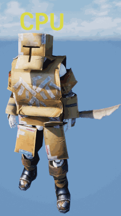
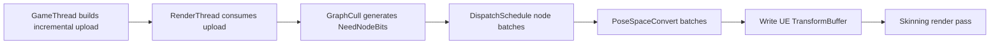
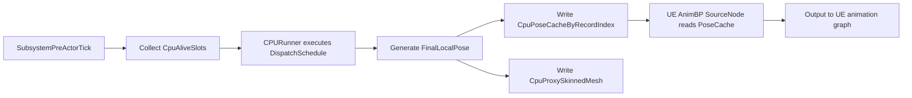
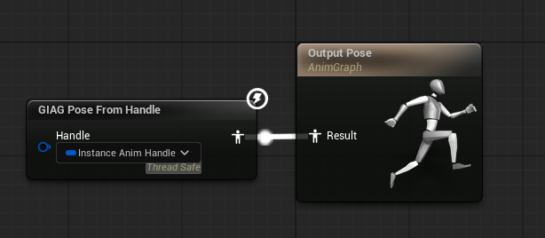
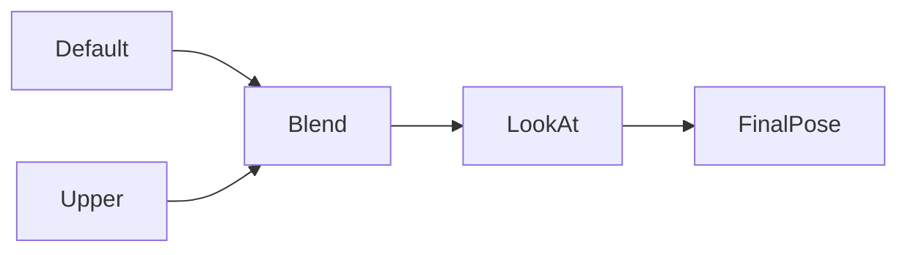
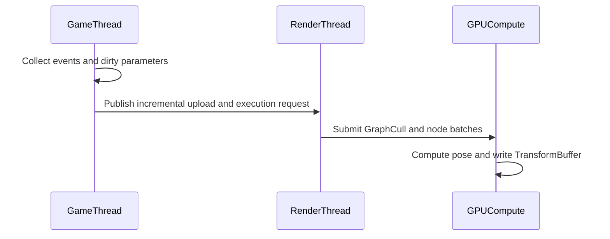

# Instanced Animation Graph (GameInstancedAnimationGraph [GIAG])

[English](README.md)|[中文](Docs/README_CN.md)|[Node Authoring Rules](Docs/NewNodeRule.md)

This design starts from a single question: if a game contains a massive number of animated entities, how can the animation system keep programmable behavior while still delivering practical large-scale performance?


This document is a framework design overview. It focuses on the system layers, data flow, and performance strategy.

## Framework Approach

GIAG is designed to reduce animation simulation cost for large numbers of entities. It provides two isomorphic high-performance paths, CPU and GPU, and lets gameplay code assign instances according to its LOD strategy.

Core principles:

- CPU path for high-fidelity near-field animation: instances close to the player, heavy in interaction, or requiring higher visual quality can switch to CPU.
- GPU path for large-scale LOD: mid-field, far-field, and massive crowds run through GPU compute with throughput as the priority.
- Event-driven uploads: instead of synchronizing all data every frame, only dirty data is uploaded when state changes.
- Compile-time preparation: topology analysis, dispatch batching, and pose-space convergence are completed as much as possible during compilation.
- Gameplay-side quota control: for example, keep at most 16 CPU instances on screen and send the rest to GPU. This framework does not implement that policy; gameplay logic should decide it.

Design tradeoffs:

- Prioritize the overall balance between near-field quality and far-field throughput instead of optimizing only one backend.
- Accept some system complexity in exchange for a stable frame budget when the instance count reaches tens of thousands or more.
- Reduce dual-backend maintenance risk through isomorphic CPU/GPU semantics.
- Because both backends share the same logic model, pose and behavior changes during switching are controllable, and visual discontinuities are much smaller than in heterogeneous solutions.



### Key Performance Constraints and Strategies

- Event-driven extrapolation: the CPU submits events only when state changes. The GPU extrapolates playback progress every frame from the current time instead of receiving full per-frame synchronization.  
  Extrapolation formula, simplified:

  $$
  t_{\text{raw}}=(t_{\text{now}}-t_{\text{event}})\cdot Rate+t_{\text{start}}
  $$

  The theoretical playback time is derived from the elapsed time since the event occurred.

- Node batching: after compilation, nodes are executed in batches by node type (`DispatchSchedule`), so nodes of the same type share a single dispatch path.  
  - Reduces dispatch count and driver overhead.
  - Lowers state-switching cost and improves data locality on both GPU and CPU.
  - Provides more stable throughput for high instance counts.

- Sparse dirty-data uploads: parameters and transforms are uploaded with slot-level dirty marking, avoiding "all instances, all nodes, every frame" retransmission.

- Active instance filtering: `ActiveInstanceIndices` works with visibility and gameplay LOD so only currently required instances are evaluated.

## Compilation Flow

GIAG converts a "programmable animation graph" into efficient runtime data and scheduling structures during compilation.

Main stages:

1. Graph construction: `BuildGraph` declares nodes, links, and the final output.
2. Node compilation: collect node metadata, instance offsets, parameter layouts, and input/output pin information.
3. Resource planning: allocate pose resources and generate pose-space conversion tasks (`PoseConvertTasks`).
4. Schedule generation: build `ExecOrder`, `DispatchSchedule`, and `ReverseDispatchSchedule`.
5. Cull compilation: generate node-cull tables and graph-level cull resource binding information.

Compilation outputs directly serve runtime execution:

- Runtime does not need to perform topological sorting again.
- Batches are grouped by node type, reducing scheduling overhead.
- Pose spaces explicitly converge inside the dispatch chain, reducing the cost of implicit conversions.

## GPU Backend

The GPU backend uses a GT/RT division of responsibility:

- GT (GameThread): collects dirty data, builds incremental upload packages, and publishes tasks and resource requests.
- RT (RenderThread): consumes upload packages, builds RDG passes, drives compute execution, and writes into `TransformBuffer`.

Resource preparation flow:

- Skeleton static resources: `ParentIndices`, `InverseRefPose`, and `RefPose`.
- Animation library resources: clip metadata and TRS data, with support for incremental updates and capacity expansion.
- Node parameter resources: sparse uploads according to each node's parameter layout.
- Active instance mapping: `ActiveInstanceIndices`, used to evaluate only visible or active slots.

Configuration preparation flow:

- Bind compilation outputs, including schedule tables, pose resources, and cull parameter symbols.
- Bind runtime parameters, including instance count, bone count, time, and output offset.
- When culling is available, execute `GraphCull` first to generate `NeedNodeBits`, then drive node-batch dispatch.

Main GPU scheduling path, from the framework's perspective:



## CPU Backend

Main CPU scheduling path, including output to the UE animation graph:



Main path notes:

- CPU poses are precomputed on the GT before the frame's actor tick, avoiding repeated solving in the multithreaded AnimBP phase.
- `CpuPoseCache` acts as the bridge layer and is read directly by the UE animation graph Source Node.
- For pure CPU proxy instances, output is also synchronized to `CpuProxyActor/SkinnedMeshComponent` to keep visible results consistent.

Typical CPU backend use cases:

- High-fidelity near-field animation: important characters near the player or interaction-heavy characters should prefer CPU.
- Mixed LOD: some instances in the same world can run on CPU while others run on GPU.

### ISPC Acceleration

ISPC (Intel SPMD Program Compiler) can be understood as a tool that compiles code written in a scalar-like style into CPU SIMD vector instructions.  
It addresses operator performance on the CPU side and does not change the topology or scheduling semantics of the animation graph.
At the pure compute level, it can provide 4x or 8x performance improvement, depending on the supported instruction set of the target platform.

Why it fits GIAG:

- Animation computation contains many loops with "the same logic over batches of data" across instances and bones, which is naturally suited for SIMD.
- Hot paths such as pose-space conversion, TRS operations, and batch blending are mostly pure math, with few branches and stable data structures.
- When AVX2, AVX-512, or similar instruction sets are available, ISPC can usually reduce per-frame CPU computation time significantly. The actual gain depends on the platform and data shape.

### Integration with the UE Animation System



- Keep the data entry point consistent with the UE rendering pipeline.
- Let GIAG plug in as an "animation compute backend" instead of breaking UE's existing rendering organization.

## Minimal Gameplay API Usage

Gameplay code usually only needs to pass a `SkeletalMesh`, a GIAG graph asset, and an initial transform to `UGameInstancedAnimationGraphSubsystem`. The returned `FGameInstancedAnimationGraphHandle` is then used for playback, LOD backend switching, and lifetime management.

Minimal creation flow in C++:

```cpp
#include "GameInstancedAnimationGraphSubsystem.h"
#include "GIAG_AnimGraph.h"
#include "GIAG_LookAtNode.h"
#include "Engine/World.h"

FGameInstancedAnimationGraphHandle SpawnGIAGInstance(
    const UObject* WorldContextObject,
    USkeletalMesh* Mesh,
    UGIAG_AnimGraph* Graph,
    UAnimSequence* Idle,
    TSubclassOf<AActor> CpuProxyClass,
    const FTransform& InitialTransform)
{
    UWorld* World = WorldContextObject ? WorldContextObject->GetWorld() : nullptr;
    UGameInstancedAnimationGraphSubsystem* Subsystem =
        World ? World->GetSubsystem<UGameInstancedAnimationGraphSubsystem>() : nullptr;
    if (!Subsystem || !Mesh || !Graph)
    {
        return {};
    }

    // bCpuMode=false starts on GPU; gameplay LOD can switch it to CPU later.
    FGameInstancedAnimationGraphHandle Handle =
        Subsystem->AddInstance(Mesh, Graph, InitialTransform, CpuProxyClass, false);
    if (!Handle)
    {
        return {};
    }

    Subsystem->PlayAnimation(Handle, Idle, TEXT("Default"), 0.0f, 0.0f, true, 1.0f);
    return Handle;
}
```

Common runtime operations:

```cpp
// Gameplay LOD: switch close or interaction-heavy instances to CPU, and distant ones back to GPU.
Subsystem->SetInstanceUseCPUMode(Handle, bShouldUseCPU);

// Update the instance world transform.
Subsystem->SetInstanceTransform(Handle, NewTransform);

// Modify runtime node parameters, for example a LookAt target.
auto LookAtNode = Subsystem->FindAnimNode<FGIAG_LookAtNode>(Handle, TEXT("LookAt"));
if (LookAtNode)
{
    LookAtNode->SetTargetLocationWS(LookAtNode, TargetLocationWS);
}

// Release the instance when it is no longer needed. The handle becomes invalid.
Subsystem->RemoveInstance(Handle);
```

Common extension APIs:

- Leader/Follow: `AddFollowInstance(MasterHandle, FollowMesh)` creates a follower instance that reuses the master's animation and transform. This is useful for equipment and attached skeletal meshes.
- Attach: `AttachStaticMesh(...)` / `AttachNiagara(...)` bind a static mesh or Niagara system to a specific bone output.
- Per-instance material data: `SetMaterialDataFloat(...)`, `SetMaterialDataVector2(...)`, `SetMaterialDataVector3(...)`, and `SetMaterialDataColor(...)` write material parameters per instance, commonly used for color, faction, hit highlight, and similar presentation data.
- Backend query: `IsInstanceUsingCPUMode(Handle)` is useful for debugging or synchronizing gameplay state.

## Additional System Support

Because the framework has a GPU path, it should avoid GPU-to-CPU readback.  
The following features therefore also need additional implementation:

### Leader/Follow Mesh

The Leader/Follow mechanism reduces repeated computation:

- The Leader is responsible for animation evaluation and output.
- The Follower reuses the Leader's result and can perform bone mapping when needed.
- This mechanism mainly optimizes cases such as equipment, where the attached mesh must stay consistent with the main animation.

### Mesh/Niagara Attach

The attach system extends animation bone output to effects and attachments:

- Mesh Attach: attaches static meshes to bone output.
- Niagara Attach: attaches particle systems to bone output.

## Graph Authoring

### Minimal Node Example: ClipNode/Blend/LookAt

Minimal graph implementation code, simplified:

```cpp
// 1) GraphInstance: node instances live in the same struct, matching the project examples.
USTRUCT()
struct FMyGraphInstance : public FGIAG_AnimGraphInstance
{
    GENERATED_BODY()

    FGIAG_ClipPlayerNode Default;
    FGIAG_ClipPlayerNode Upper;
    FGIAG_LayerBlendNode LayerBlend;
    FGIAG_LookAtNode LookAt;
};

// 2) AnimGraph: owns DefaultGraphInstance and builds the graph from its members in BuildGraph.
UCLASS()
class UMyGIAGGraph : public UGIAG_AnimGraph
{
    GENERATED_BODY()
public:
    FMyGraphInstance DefaultGraphInstance;

    FGIAG_BlendLayerSettings BlendSettings;
    FGIAG_LookAtSettings LookAtSettings{ TEXT("head") };

    virtual FGIAG_AnimGraphInstanceRef GetDefaultGraphInstance() const override
    {
        return { DefaultGraphInstance };
    }

    virtual void BuildGraph(FGIAG_AnimGraphBuilder& Builder) const override
    {
        const auto& Instance = DefaultGraphInstance;

        const auto Default = Builder.AddNode(Instance.Default);
        const auto Upper = Builder.AddNode(Instance.Upper);
        const auto Blend = Builder.AddNode(Instance.LayerBlend, BlendSettings);
        const auto LookAt = Builder.AddNode(Instance.LookAt, LookAtSettings);

        Builder.Link(GIAG_PIN_OUT(Default, Out), GIAG_PIN_IN(Blend, Base));
        Builder.Link(GIAG_PIN_OUT(Upper, Out), GIAG_PIN_IN(Blend, Layer));
        Builder.Link(GIAG_PIN_OUT(Blend, Out), GIAG_PIN_IN(LookAt, Base));

        Builder.SetFinalPose(GIAG_PIN_OUT(LookAt, Out));
    }
};

// 3) Modify dynamic node parameters at runtime.
void SetRuntimeParams(const UObject* WorldContextObject, const FGameInstancedAnimationGraphHandle& Handle)
{
    UGameInstancedAnimationGraphSubsystem* Subsystem = World->GetSubsystem<UGameInstancedAnimationGraphSubsystem>();
    auto LookAtNode = Subsystem->FindAnimNode<FGIAG_LookAtNode>(Handle, TEXT("LookAt"));
    LookAtNode->SetTargetLocationWS(LookAtNode, TargetLocationWS);
}
```



## Node Authoring

GIAG node authoring follows the principle of "one contract, dual-backend execution."

For the complete new-node rules, CPU/GPU minimal template, and implementation contracts, see [Node Authoring Rules](Docs/NewNodeRule.md).

Node contract:

- Clearly define input/output pin semantics.
- Declare optional resource requests, when needed and not as a requirement.
- Provide corresponding GPU and CPU execution entry points.
- Optionally provide cull logic that stays consistent across CPU and GPU.

Minimal node implementation example, simplified and omitting full parameter and registration details:

```cpp
// C++: minimal BlendNode shape, simplified.
USTRUCT(BlueprintType)
struct FGIAG_MinBlendNode : public FGIAG_AnimNodeBase
{
    GENERATED_BODY()

    enum class EInputPin : uint8 { A = 0, B, Num };
    enum class EOutputPin : uint8 { Out = 0, Num };

    float Alpha = 0.5f;

    const void* GatherUploadsGPU(uint32& OutStride) const
    {
        OutStride = sizeof(float);
        return &Alpha;
    }

    static void AddPassesGPU(const FGIAG_AnimNodeDispatchContext& Ctx)
    {
        // Bind A/B input poses and the Alpha parameter, then dispatch BlendCS.
    }

    static void AddPassesCPU(const FGIAG_AnimNodeCpuDispatchContext& Ctx)
    {
        // Call an ISPC kernel to blend bones over active slots.
    }
};
```

```hlsl
// HLSL: minimal Blend kernel, simplified.
StructuredBuffer<float4> InPoseA;
StructuredBuffer<float4> InPoseB;
StructuredBuffer<float>  NodeAlpha;
RWStructuredBuffer<float4> OutPose;

[numthreads(64, 1, 1)]
void Main(uint DispatchId : SV_DispatchThreadID)
{
    float a = saturate(NodeAlpha[0]);
    float4 pa = InPoseA[DispatchId];
    float4 pb = InPoseB[DispatchId];
    OutPose[DispatchId] = lerp(pa, pb, a);
}
```

```ispc
// ISPC: minimal CPU-side Blend kernel, simplified.
export void GIAG_BlendPose(
    uniform int count,
    uniform float alpha,
    uniform const float4* poseA,
    uniform const float4* poseB,
    uniform float4* outPose)
{
    foreach (i = 0 ... count)
    {
        outPose[i] = poseA[i] * (1.0f - alpha) + poseB[i] * alpha;
    }
}
```

### Isomorphic CPU/GPU Math Strategy

GIAG first abstracts algorithms into platform-independent mathematical cores, then lets HLSL and ISPC handle only type mapping.

Recommended approach:

1. Define a cross-backend consistent data layout first, using POD data and explicit padding, such as `FGIAG_BoneTRS`.  
2. Keep the shared layer pure math, without dependencies on UE objects, thread state, or platform-specific APIs.

Minimal template, following the style of `GIAG_MathShared.ush`:

```cpp
// Shared/GIAG_MathShared.ush: platform-independent core.
struct FGIAG_BoneTRS
{
    FQuat Rotation;
    float3 Translation;
    float TranslationPad;
    float3 Scale3D;
    float ScalePad;
};

GIAG_INLINE FQuat GIAG_NormalizeQuat(FQuat Q)
{
    const float Len2 = dot(Q, Q);
    return Q * rsqrt(Len2);
}

GIAG_INLINE FQuat GIAG_AlignQuatToRef(FQuat Ref, FQuat Q)
{
    return (dot(Ref, Q) < 0.0) ? Q * (-1.0) : Q;
}
```

The cross-CPU/GPU platform "magic" is macro mapping:

```hlsl
// HLSL wrapper: maps types only and does not rewrite the algorithm.
typedef float4 FQuat;
#define GIAG_FLOAT3(x,y,z) float3(x,y,z)
#define GIAG_FLOAT4(x,y,z,w) float4(x,y,z,w)
#define GIAG_GET4(v,i) ((v)[i])
#include "/GameInstancedAnimationGraphShader/Shared/GIAG_MathShared.ush"
```

```cpp
// ISPC wrapper: also maps types only and does not rewrite the algorithm.
typedef FVector4f FQuat;
#define GIAG_FLOAT3(x,y,z) make_float3((x),(y),(z))
#define GIAG_FLOAT4(x,y,z,w) SetVector4((x),(y),(z),(w))
#define GIAG_GET4(v,i) ((v).V[(i)])
#include "GIAG_MathShared.ush"
```

The value of this approach is that CPU/GPU algorithm evolution remains bound to the same core implementation. Behavior and visuals are more stable when switching paths, and long-term drift is less likely.

### Runtime Timing Overview (GT/RT/GPU)



## Current Issues

- The GPU backend rendering layer currently covers only Nanite Mesh. For mobile or non-Nanite paths, the project side needs to add the corresponding `RenderProxy` and rendering integration.
- Because Niagara render commands execute first, Niagara Attach cannot correctly receive the current frame's animation result. In practice, Niagara attachments are delayed by one frame.

### UE Skinning TransformBuffer Encoding Limit

In UE's `Engine/Shaders/Shared/SkinningDefinitions.h`, `FSkinningHeader::TransformBufferOffset` is controlled by `SKINNING_BUFFER_TRANSFORM_OFFSET_BITS`. Baseline value is `22`:

```cpp
#define SKINNING_BUFFER_TRANSFORM_OFFSET_BITS 22
```

That gives a maximum encodable `TransformBufferOffset` range of approximately:

```text
OffsetMax = 2^22 - 1 = 4,194,303
```

UE allocates TransformBuffer space for both current-frame and previous-frame bone transforms. The core relationship can be estimated as:

```text
TransformNeededSize = UniqueAnimationCount * MaxTransformCount * 2
MaxInstances ~= floor(2^22 / (MaxTransformCount * 2))
```

Where:

- `UniqueAnimationCount` roughly maps to the number of animated instances in the same render batch.
- `MaxTransformCount` is the maximum number of bone transforms reserved per instance on the UE skinning side. It is usually close to or higher than the skeleton bone count.
- `* 2` comes from the Current/Previous transform regions used for previous-frame data, velocity, motion blur, and related logic.

Example estimates:

```text
MaxTransformCount = 200: floor(4,194,304 / (200 * 2)) = 10,485
MaxTransformCount = 220: floor(4,194,304 / (220 * 2)) = 9,532
MaxTransformCount = 256: floor(4,194,304 / (256 * 2)) = 8,192
```

Therefore, without modifying the UE engine, the current GPU path should not be documented as reliably exceeding `10K` renderable simulation instances. The practical limit can be lower depending on bone count, Follow/Attach usage, other skeletal buckets, allocator fragmentation, and safety margin.

To reliably exceed `10K` instances, the UE engine skinning header bit allocation and related C++/HLSL packing logic must be changed to expand the encodable `TransformBufferOffset` range. The `FSkinningHeader` layout, shader decoding, and platform compatibility then need to be revalidated.

## Comparison with Similar Solutions

| Dimension | This Solution (GIAG) | [Vertex Anim](https://dev.epicgames.com/documentation/en-us/unreal-engine/vertex-animation-tool-in-unreal-engine) | [TurboSequence](https://github.com/LukasFratzl/TurboSequence) |
| --- | --- | --- | --- |
| Requires resource preprocessing | Does not require mandatory offline preprocessing, supports runtime incremental preparation | Strongly depends on offline baking, such as textures or caches | Requires offline baking and defines a custom offline baking flow |
| Animation blending support | Native in-graph blending at node level | Limited blending capability, often relying on combinations of prebaked assets | Supports some blending, but complex graph semantics are usually weaker than a full animation graph |
| Animation graph evaluation location | Isomorphic CPU/GPU dual paths, dynamically assigned by gameplay LOD | Mainly consumes prebaked results in the material or vertex stage | Focuses on optimizing the instanced rendering path; animation graph computation is usually not the core capability |
| Simulation scale | Without UE engine changes, limited by the Skinning TransformBuffer offset and currently estimated below `10K` instances; engine changes can extend this further | Can support extremely large rendering scale, but flexibility is constrained by prebaking | Targets medium-to-large-scale instanced characters, between traditional `SkeletalMesh` and dedicated prebaked solutions |
| Programmable animation logic | High, logic can be extended through the node system | Low, mainly determined by preprocessed assets | Medium, with project-side extension space, but graph expressiveness is usually limited |
